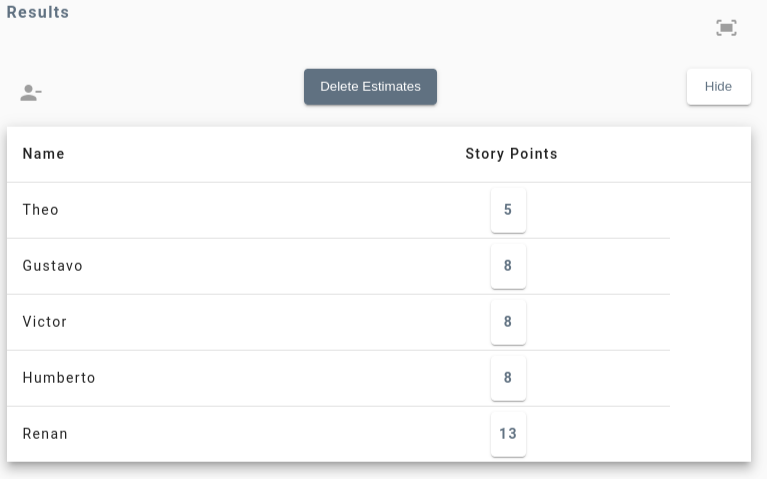
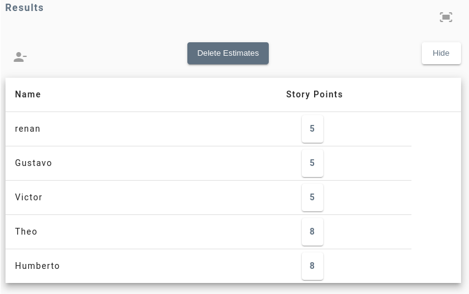

# Planning Poker

Aqui se encontra a documentação das estimativas feitas para todas as tarefas do board [sis-recomendacao-gpa-e5](https://github.com/users/CaioTeixeira95/projects/2)

### Task - [Recomendar jogos pelo perfil de usuário](https://github.com/CaioTeixeira95/sis-recomendacao-gpa-e5/issues/1)

Para essa tarefa os participantes escolheram os seguintes valores:

Pontuação final escolhida: **20 pontos**

### Task - [Recomendar jogos por classificação indicativa](https://github.com/CaioTeixeira95/sis-recomendacao-gpa-e5/issues/5)

Para essa tarefa os participantes escolheram os seguintes valores:

Pontuação final escolhida: **8 pontos**

### Task - [Recomendar jogos com preços promocionais](https://github.com/CaioTeixeira95/sis-recomendacao-gpa-e5/issues/4)

Para essa tarefa os participantes escolheram os seguintes valores:

Pontuação final escolhida: **8 pontos**

### Task - [Recomendar jogos no carrinho](https://github.com/CaioTeixeira95/sis-recomendacao-gpa-e5/issues/6)

Para essa tarefa os participantes escolheram os seguintes valores:

Pontuação final escolhida: **5 pontos**

### Task - [Recomendar jogos por categoria](https://github.com/CaioTeixeira95/sis-recomendacao-gpa-e5/issues/8)

Para essa tarefa os participantes escolheram os seguintes valores:

Pontuação final escolhida: **5 pontos**

### Task - [Recomendar outros jogos de um publisher](https://github.com/CaioTeixeira95/sis-recomendacao-gpa-e5/issues/14)

Para essa tarefa os participantes escolheram os seguintes valores:

Pontuação final escolhida: **5 pontos**

### Task - [Notificações para o usuário com recomendações](https://github.com/CaioTeixeira95/sis-recomendacao-gpa-e5/issues/10)

Para essa tarefa os participantes escolheram os seguintes valores:

Pontuação final escolhida: **5 pontos**

### Task - [Recomendar baseado na review dos usuários](https://github.com/CaioTeixeira95/sis-recomendacao-gpa-e5/issues/13)

Para essa tarefa os participantes escolheram os seguintes valores:

Pontuação final escolhida: **8 pontos**

### Task - [Recomendar jogos baseados em crítica especializadas](https://github.com/CaioTeixeira95/sis-recomendacao-gpa-e5/issues/22)

Para essa tarefa os participantes escolheram os seguintes valores:

Pontuação final escolhida: **8 pontos**

### Task - [Recomendar bundle de jogos](https://github.com/CaioTeixeira95/sis-recomendacao-gpa-e5/issues/7)

Para essa tarefa os participantes escolheram os seguintes valores:

Pontuação final escolhida: **5 pontos**

### Task - [Recomendar Expansões / DLC](https://github.com/CaioTeixeira95/sis-recomendacao-gpa-e5/issues/21)

Para essa tarefa os participantes escolheram os seguintes valores:

Pontuação final escolhida: **13 pontos**

### Task - [Recomendar com base na pesquisa do usuário](https://github.com/CaioTeixeira95/sis-recomendacao-gpa-e5/issues/12)

Para essa tarefa os participantes escolheram os seguintes valores:

Pontuação final escolhida: **5 pontos**

### Task - [Recomendar jogos baseados nos filtros de pesquisa do usuário](https://github.com/CaioTeixeira95/sis-recomendacao-gpa-e5/issues/11)

Para essa tarefa os participantes escolheram os seguintes valores:

Pontuação final escolhida: **13 pontos**

### Task - [Recomendar baseado na wishlist](https://github.com/CaioTeixeira95/sis-recomendacao-gpa-e5/issues/20)

Para essa tarefa os participantes escolheram os seguintes valores:

Pontuação final escolhida: **5 pontos**

### Task - [Recomendar baseado nos preview de gameplay assistidos pelo usuário](https://github.com/CaioTeixeira95/sis-recomendacao-gpa-e5/issues/9)

Para essa tarefa os participantes escolheram os seguintes valores:

Pontuação final escolhida: **8 pontos**

### Task - [Recomendar jogos baseados em crítica especializadas](https://github.com/CaioTeixeira95/sis-recomendacao-gpa-e5/issues/22)

Para essa tarefa os participantes escolheram os seguintes valores:

Pontuação final escolhida: **8 pontos**
